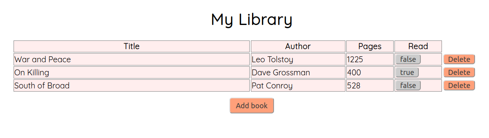

# HTML/CSS/JavaScript Library Records

This project demonstrates using client side JavaScript to add, modify and delete items in a table.

## Purpose

I completed this project as part of the full-stack web development curriculum at [theOdinProject](https://theodinproject.org), in order to learn and demonstrate my proficiency in the use of JavaScript. 

## Built With

* HTML5
* CSS3
* JavaScript

## Project Status

As of November 6, 2020, I have completed the assignment as intended. However, in the future I may revisit it, in order to make minor improvements to the overall appearance of the webpage.

## About Me

* My name: Jay Conner
* My website: [CodingCop](https://codingcop.com)
* My Twitter: [@JayConner17](https://twitter.com/JayConner17)
* My LinkedIn: [LinkedIn](https://www.linkedin.com/in/jay-c-8000196)